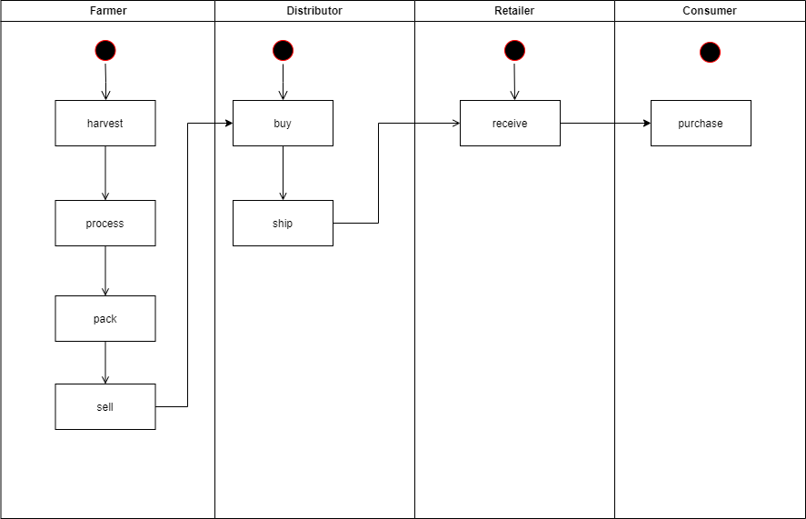
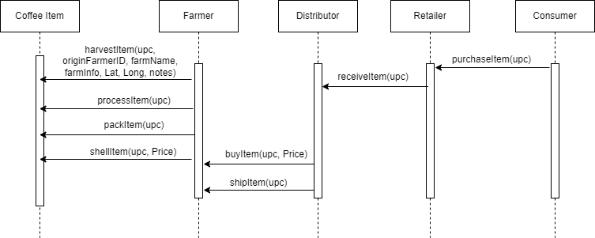
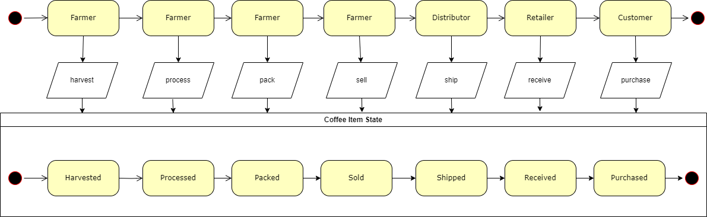
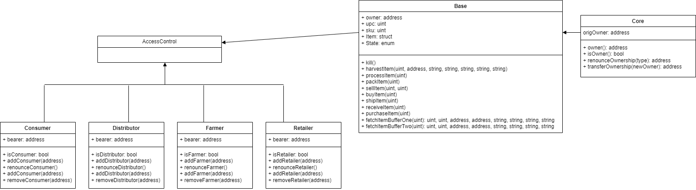
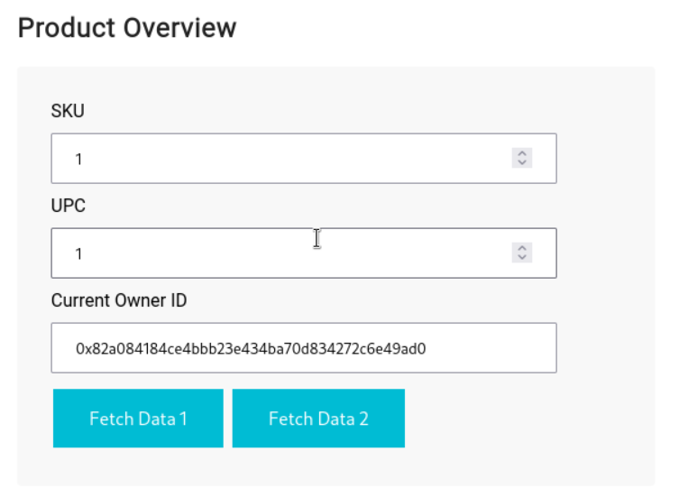
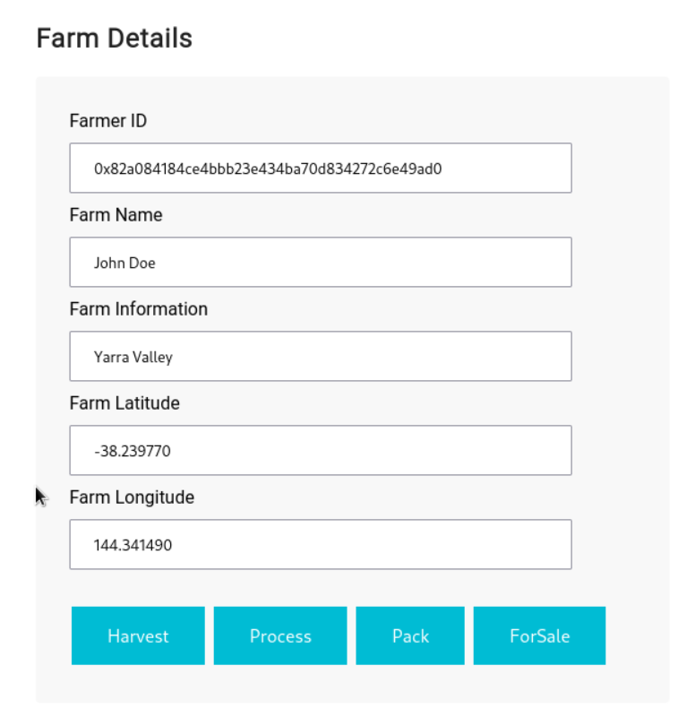
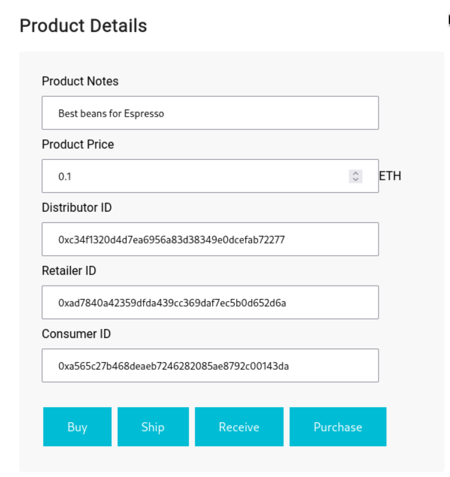
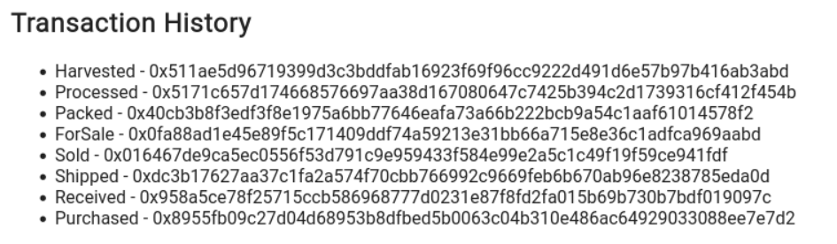

# Supply chain & data auditing

This repository containts an Ethereum DApp that demonstrates a Supply Chain flow between a Seller and Buyer. The user story is similar to any commonly used supply chain process. A Seller can add items to the inventory system stored in the blockchain. A Buyer can purchase such items from the inventory system. Additionally a Seller can mark an item as Shipped, and similarly a Buyer can mark an item as Received.

# Contract Addresses
The project's contracts have been deployed to Goerli:
* Migrations
  tx https://goerli.etherscan.io/tx/0xcc0bc1b0cb210fa6663e97e5c94709ff83df02c28f91c7bd2b3f20c486880598   
* FarmerRole 
  tx https://goerli.etherscan.io/tx/0x9646dcc14e86ce1f7ef22a655061cb8bfe79bb374dffbd91e155e69daef6e8a7
  contract https://goerli.etherscan.io/address/0xa71c53a82e7530b01889e3ec35c185a9e07a21ad
* DistributorRole
  tx https://goerli.etherscan.io/tx/0xda5a7af78b503a8e0ff5cf335197e60ee63d76b8c48f7ec29cfc3109844e3a3b
  contract https://goerli.etherscan.io/address/0x238f37377b0e47f7cd07b4b6ed44dee3a61b406b
* RetailerRole
  tx https://goerli.etherscan.io/tx/0x96e2fb992b47ef3a579015d1513d05af5584aadd8fdafddc4c4e28c61eff0584
  contract https://goerli.etherscan.io/address/0xe36dfbcc97b2dadfcdf7859a7b26e977bb4b321f
* ConsumerRole
  tx https://goerli.etherscan.io/tx/0x6dff8496b09683bc11c8526f4be51385a7fda9bb34d859b274e4e3e76ad6168d
  contract https://goerli.etherscan.io/address/0x10cc67197cbb3b7c13d536c833ac0b14dc4815de
* SupplyChain
  tx https://goerli.etherscan.io/tx/0x004da1b85abb4f5cf0efc8f5b282e7e69d10d95130a415be78a97c8618e17343
  contract https://goerli.etherscan.io/address/0x442e8dd7efc2025f133ff25406eb26d5a806ffc2

# UML Diagrams
## Activity Diagram

## Sequence Diagram

## State Diagram

## Data Diagram



# DApp User Interface
The DApp User Interface looks like...










## Getting Started

These instructions will get you a copy of the project up and running on your local machine for development and testing purposes. See deployment for notes on how to deploy the project on a live system.

### Prerequisites

Please make sure you've already installed ganache-cli, Truffle and enabled MetaMask extension in your browser.

```
Give examples (to be clarified)
```

### Installing

> The starter code is written for **Solidity v0.4.24**. At the time of writing, the current Truffle v5 comes with Solidity v0.5 that requires function *mutability* and *visibility* to be specified (please refer to Solidity [documentation](https://docs.soliditylang.org/en/v0.5.0/050-breaking-changes.html) for more details). To use this starter code, please run `npm i -g truffle@4.1.14` to install Truffle v4 with Solidity v0.4.24. 

A step by step series of examples that tell you have to get a development env running

Clone this repository:

```
git clone https://github.com/udacity/nd1309/tree/master/course-5/project-6
```

Change directory to ```project-6``` folder and install all requisite npm packages (as listed in ```package.json```):

```
cd project-6
npm install
```

Launch Ganache:

```
ganache-cli -m "spirit supply whale amount human item harsh scare congress discover talent hamster"
```

Your terminal should look something like this:


In a separate terminal window, Compile smart contracts:

```
truffle compile
```

Your terminal should look something like this:


This will create the smart contract artifacts in folder ```build\contracts```.

Migrate smart contracts to the locally running blockchain, ganache-cli:

```
truffle migrate
```

Your terminal should look something like this:


Test smart contracts:

```
truffle test
```

All 10 tests should pass.


In a separate terminal window, launch the DApp:

```
npm run dev
```

## Built With

* [Ethereum](https://www.ethereum.org/) - Ethereum is a decentralized platform that runs smart contracts
* [IPFS](https://ipfs.io/) - IPFS is the Distributed Web | A peer-to-peer hypermedia protocol
to make the web faster, safer, and more open.
* [Truffle Framework](http://truffleframework.com/) - Truffle is the most popular development framework for Ethereum with a mission to make your life a whole lot easier.


## Authors

See also the list of [contributors](https://github.com/your/project/contributors.md) who participated in this project.

## Acknowledgments

* Solidity
* Ganache-cli
* Truffle
* IPFS
